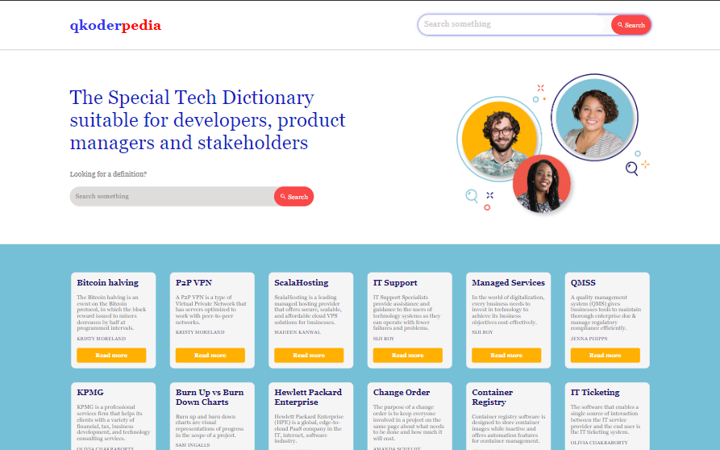

# Queen Koders React with Vite Project

## Task

- This is a simple project done by the Queen Koders team which involves initializing react with vite, creating a mock data and displaying the content fetched from the data on to the UI.

 ## Guideline to view the project

 To view the project on your local machine.
 - Clone the repository 

 ``https://github.com/Perpy-del/queen-koders-react``

 - Change your current working directory to the project directory

 ``cd queen-koders-react``

 - Install all dependencies and packages
 ``npm install``

 - Run the project on your local machine
 ``npm run dev``

 ## Contributors include
 - [Tosin Bamidele](https://github.com/TosinMary) 
 - [Chizaram Anisimuo](https://github.com/thezaram)
 - [Sylvia Nnoruka](https://github.com/SYLVIANNORUKA)
 - [Blessing Peter](https://github.com/blessingpeters)
 - [Stella Ugoo-Okonkwo](https://github.com/Ozyugoo)
 - [Wokrit Bakkuk](https://github.com/wokrit)
 - [Perpetual Meninwa](https://github.com/Perpy-del)
 - [Chioma Ekpemerechi](https://github.com/codiadem)
 - [Udoka Kasie](https://github.com/UdokaSuccess)

 ## Deployment
 The project was done using HTML and vanilla CSS. It was deployed using Vercel. Here is the link to the deployed project.
 [Queen Koders React Project](https://perpy-del.github.io/queen-koders-react)

 ## Screenshot of the project
